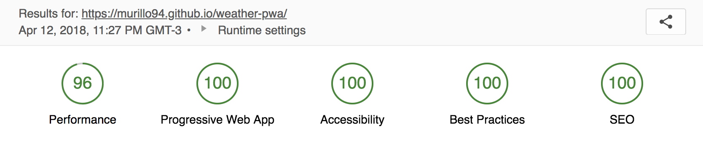

# Weather App (PWA)

Find out the current weather forecast in any city around the world. Download the app directly from a browser and use anywhere 😀

## About

I built this app to learn more about the idea of [styled components](https://github.com/styled-components/styled-components) with React and [PWA](https://developers.google.com/web/progressive-web-apps/) concepts too.

## The Project

The main idea of this project is that anyone wants discover the weather around the world or local can search and find easily, with a nice UI and great usability.

## To-Do

- [x] Minify better build prod (styled-components)
- [x] Meta description in index.html (seo)
- [ ] Do a loading when click in the button "My location"
- [ ] Do the buttons be componets
- [ ] On search do to not re-render the components when enter some letter. ( shouldComponentUpdate )
- [ ] Do reload the list in a specific item
- [ ] Do service-worker work offline
- [ ] Do code splitting
- [ ] Do a button to share the weather with friends by a url
- [ ] Remove "react-onclickoutside" from ViewCityOptions and do pure function like that.

## Lighthouse Report

## url

https://murillo94.github.io/weather-pwa/