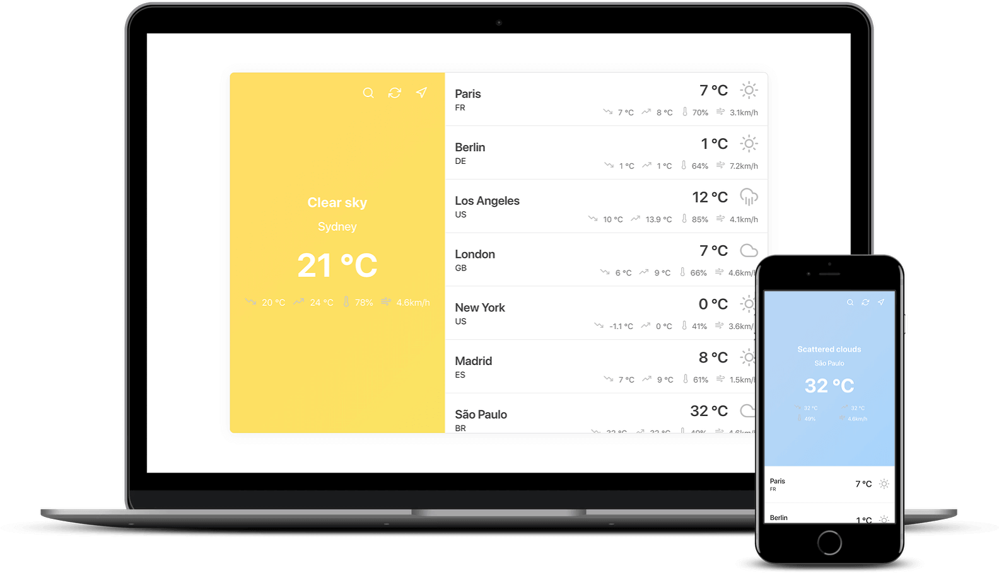

# Weather App (PWA)

Find out the current weather forecast in any city around the world. Download the app directly from a browser and use anywhere 😀

## About

I built this app to learn more about the idea of [styled components](https://github.com/styled-components/styled-components) with React, [PWA](https://developers.google.com/web/progressive-web-apps/) concepts and [PRPL](https://developers.google.com/web/fundamentals/performance/prpl-pattern/) pattern too.
The project main idea is that anyone wants discover the weather around the world or local can search and find easily, with a nice UI and great usability.

  

# APIs

- https://openweathermap.org/api

# Features

- PWA
- Responsive
- Offline ready (in progress)
- Installable (add to Homescreen)

# Built with

- ES6
- React
- Styled Components (styled-components)

## TODO

- Button to show infos about the project (bottom right in the main city info)
- Button to share the weather with friends by a url
- Service-worker to work offline

## url

https://murillo94.github.io/weather-pwa/
